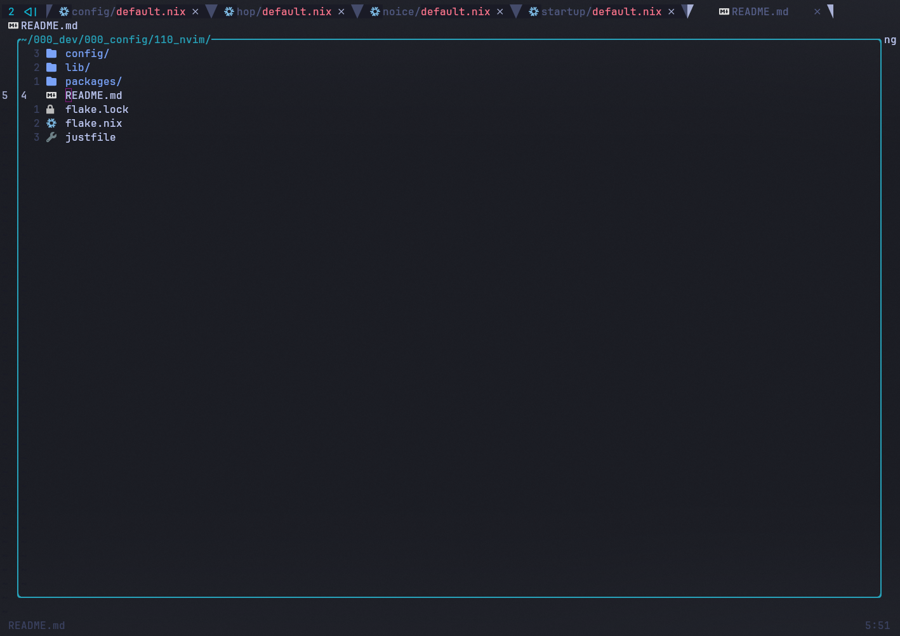
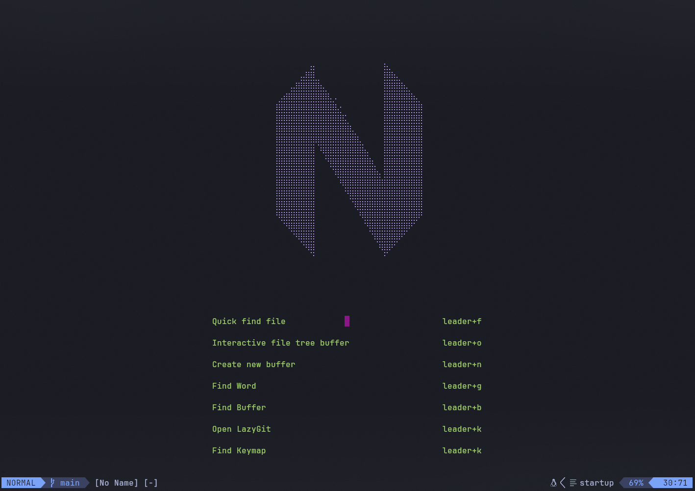

My person neovim configuration configured with telescope, oil.nvim, hop, yanky, cmp, treesitter, and various LSP clients and related language plugins.

Here's how it looks in action:

`Editing in this repo:`

`Using the interactive filetree buffer (oil.nvim):`

`Welcome buffer via startup.nvim:`

### About this project

This project aims to be a fairly feature-complete and configurable neovim/nixvim configuration. It takes inspiration from [LunarVim](https://github.com/LunarVim/LunarVim) and [NvChad](https://github.com/NvChad/NvChad). You are welcome to use this configuration as a base for your own via forking or use what it provides and contribute / PR if you have changes or features or fixes that you have found move the project forward. I will be paying attention to the repo with the aim of triaging issues and reviewing PRs.
